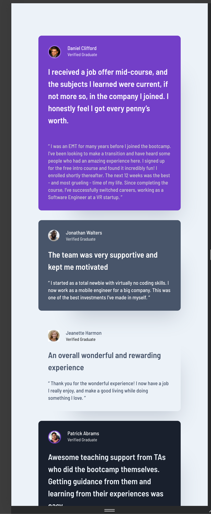
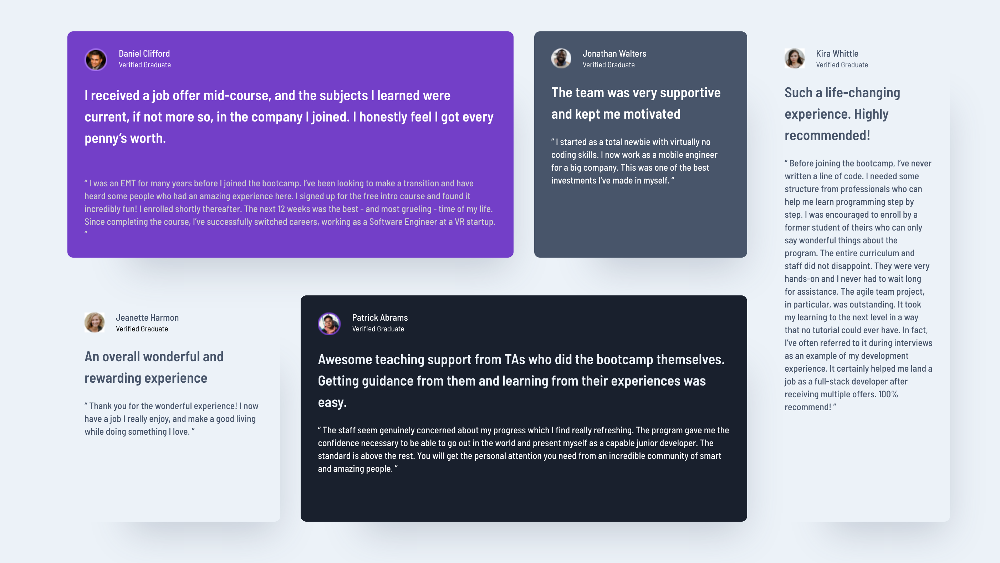

# Frontend Mentor - Testimonials Grid

This is a solution to the [Social links profile challenge on Frontend Mentor](https://www.frontendmentor.io/challenges/social-links-profile-UG32l9m6dQ). Frontend Mentor challenges help you improve your coding skills by building realistic projects.

## Table of contents

- [Overview](#overview)
  - [The challenge](#the-challenge)
  - [Screenshot](#screenshot)
  - [Links](#links)
- [My process](#my-process)
  - [Built with](#built-with)
  - [What I learned](#what-i-learned)
  - [Continued development](#continued-development)
  - [Useful resources](#useful-resources)
- [Author](#author)
- [Acknowledgments](#acknowledgments)

## Overview

- A responsive layout on mobile first which stacks testimonial cards on top of each other. When widened the cards rearrange in to a grid collage. This is was accomplished using CSS Grid and a Grid area.

### The challenge

Users should be able to:

- Read the testimonials on mobile and use scroll to read next card.
- Read testimonial on wider resolution screen as collage.

### Screenshots





### Links

- [Check out the code here](https://github.com/John-Davidson-8/fem-testimonials-grid-section)
- [Check out the site here](https://fem-testimonials-grid-section-main.netlify.app/)

## My process

- My process with this project was to start mobile first and use as many grouping of utility classes as possible. For the desktop version I put the collage into place use CSS Grid and Grid areas which worked a treat.

### Built with

- Semantic HTML5 markup
- CSS custom properties
- CSS Grid
- Mobile-first workflow

### What I learned

I learned how to use Figma more appropriately. Learning the basics of Figma I feel is vital moving forward. I also learned much about using CSS Grid and Grid areas. I also used semantic elements for each card, that is instead of div's for each testimonial card I used the section element as seen below. Also below is the media query used with CSS Grid embedded for transitioning from a stack in the mobile to a collage using 2 rows and 4 columns.

```html
<!-- jonathan card -->
<section class="jonathan-card card">
  <div class="flex-avatar">
    
    <div class="avatar-details">
      <p class="avatar-name avatar-text-white">Jonathan Walters</p>
      <p class="avatar-verify avatar-verify-white">Verified Graduate</p>
    </div>
  </div>
  <div>
    <h3>The team was very supportive and kept me motivated</h3>
    <p class="testimonial jonathan-testimonial">
      “ I started as a total newbie with virtually no coding skills. I now work
      as a mobile engineer for a big company. This was one of the best
      investments I’ve made in myself. “
    </p>
  </div>
</section>
<!-- end of jonathan card -->
```

```css
/* media queries  */
@media (min-width: 40rem) {
  main {
    max-width: 80rem;
    display: grid;
    grid-template-columns: repeat(4, 1fr);
    grid-template-rows: repeat(2, 1fr);
    gap: 1.8rem;
  }
  .daniel-card {
    grid-area: 1 / 1 / 2 / 3;
  }
  .jonathan-card {
    grid-area: 1 / 3 / 2 / 4;
  }
  .jeanette-card {
    grid-area: 2 / 1 / 3 / 2;
  }
  .patrick-card {
    grid-area: 2 / 2 / 3 /4;
  }
  .kira-card {
    grid-area: 1 / 4 / 3 / 5;
  }
}
```

### Continued development

General layout principles even for the most basic project helps my learning.

### Useful resources

- Slaying the Dragon's Youtube tutorial on CSS Grid was excellent and explained Grid in 13 minutes! Fantastic.

## Author

- Frontend Mentor - [@John-Davidson-8](https://www.frontendmentor.io/profile/John-Davidson-8)
- Github (https://github.com/John-Davidson-8)
